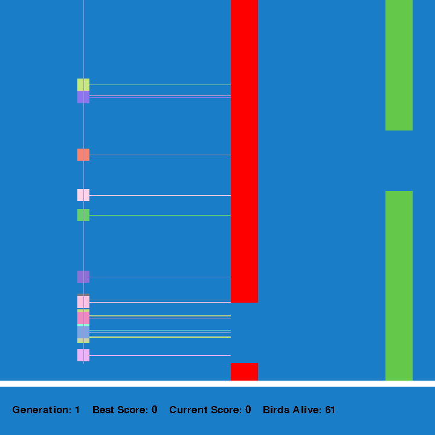
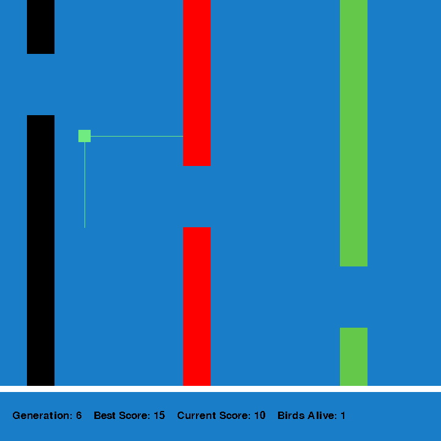

# Flappy-Bird-AI
An AI that plays flappy bird using neuroevolution. The bird is controlled using a feedforward neural network. The neural network evolves over time using a genetic algorithm.

# Dependencies
- pygame

# Controls
space: toggle between normal time and fast time
